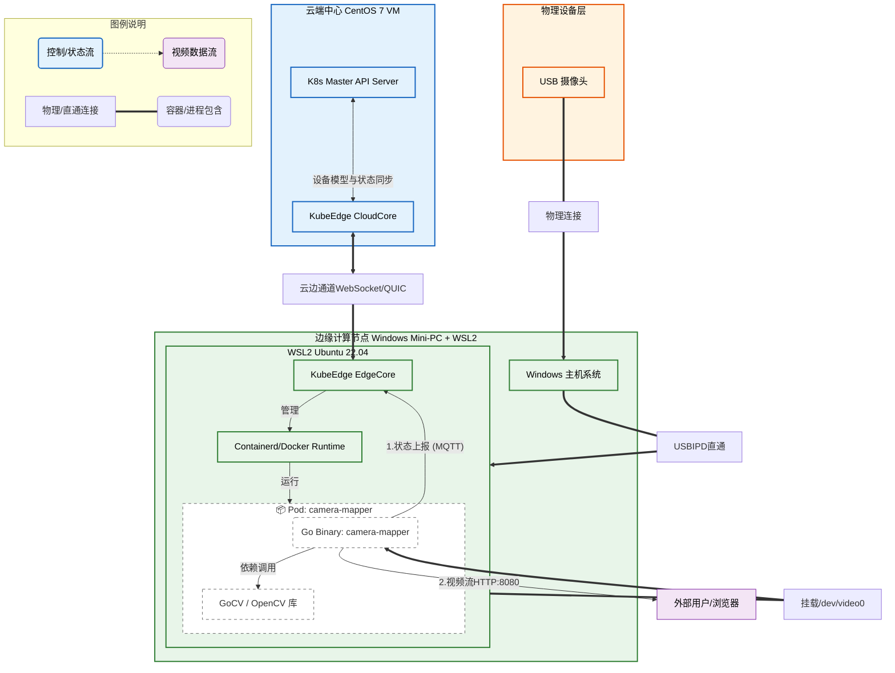

本文档记录了基于 KubeEdge 官方 `mapper-framework` 脚手架生成 Camera Mapper，并适配 GoCV (OpenCV) 进行视频流采集与推流的完整流程。

## 1. 工程初始化

使用官方脚手架生成标准目录结构。

### 1.1 克隆与生成

在 WSL 环境中执行以下步骤：

```Bash
# 1. 克隆官方 Mapper 框架
git clone https://github.com/kubeedge/mapper-framework.git
cd mapper-framework

# 2. 切换到匹配的分支 (推荐与 KubeEdge 版本一致，这里使用 release-1.20)
git checkout release-1.20 

# 3. 运行交互式生成器
make generate
```

### 1.2 生成选项配置

在交互式命令行中输入以下配置：

- **Mapper Name**: `camera-mapper`
    
- **Build Method**: `nostream`
    

> **为什么要选 `nostream`？** 虽然业务涉及视频流，但在 KubeEdge 定义中，`stream` 模式用于通过 MQTT/HTTP 数据通道上传高频传感器数据。视频流数据量过大，会阻塞 EdgeCore。
> 
> **架构策略**：
> 
> - **控制面**（分辨率、状态）：走 KubeEdge 标准通道 (nostream)。
>     
> - **数据面**（视频画面）：走自定义 HTTP 旁路服务 (Sidecar 模式)。
>     

---

## 2. 依赖管理 (核心修复)

生成的项目通常面临 Kubernetes 依赖版本冲突（Dependency Hell）。我们需要强制替换依赖版本并引入 GoCV。
### 2.1 修改 `go.mod`

编辑 `camera-mapper/go.mod`，完全替换为以下内容：

```Go

module github.com/kubeedge/camera-mapper

go 1.22.0

require (
    github.com/kubeedge/mapper-framework v1.0.0
    github.com/kubeedge/api v1.20.0
    github.com/spf13/pflag v1.0.5
    k8s.io/klog/v2 v2.120.1
    // 引入 GoCV 库
    // ！！！注意gocv的版本，要与Linux安装的opencv版本兼容
    gocv.io/x/gocv v0.31.0
)

replace (
    // 1. 强制使用本地的 mapper-framework 源码
    github.com/kubeedge/mapper-framework => ../mapper-framework

    // 2. Kubernetes 依赖修复 (K8s v1.28.6) - 解决版本冲突
    k8s.io/api => k8s.io/api v0.28.6
    k8s.io/apiextensions-apiserver => k8s.io/apiextensions-apiserver v0.28.6
    k8s.io/apimachinery => k8s.io/apimachinery v0.28.6
    k8s.io/apiserver => k8s.io/apiserver v0.28.6
    k8s.io/cli-runtime => k8s.io/cli-runtime v0.28.6
    k8s.io/client-go => k8s.io/client-go v0.28.6
    k8s.io/component-base => k8s.io/component-base v0.28.6
    k8s.io/component-helpers => k8s.io/component-helpers v0.28.6
    k8s.io/controller-manager => k8s.io/controller-manager v0.28.6
    k8s.io/cluster-bootstrap => k8s.io/cluster-bootstrap v0.28.6
    k8s.io/code-generator => k8s.io/code-generator v0.28.6
    k8s.io/cri-api => k8s.io/cri-api v0.28.6
    k8s.io/csi-translation-lib => k8s.io/csi-translation-lib v0.28.6
    k8s.io/dynamic-resource-allocation => k8s.io/dynamic-resource-allocation v0.28.6
    k8s.io/kms => k8s.io/kms v0.28.6
    k8s.io/kube-aggregator => k8s.io/kube-aggregator v0.28.6
    k8s.io/kube-controller-manager => k8s.io/kube-controller-manager v0.28.6
    k8s.io/kube-proxy => k8s.io/kube-proxy v0.28.6
    k8s.io/kube-scheduler => k8s.io/kube-scheduler v0.28.6
    k8s.io/kubectl => k8s.io/kubectl v0.28.6
    k8s.io/kubelet => k8s.io/kubelet v0.28.6
    k8s.io/legacy-cloud-providers => k8s.io/legacy-cloud-providers v0.28.6
    k8s.io/metrics => k8s.io/metrics v0.28.6
    k8s.io/mount-utils => k8s.io/mount-utils v0.28.6
    k8s.io/pod-security-admission => k8s.io/pod-security-admission v0.28.6
    k8s.io/sample-apiserver => k8s.io/sample-apiserver v0.28.6
)
```

^13b977

 #注意 注意gocv的版本，要与Linux安装的opencv版本兼容
  
### 2.2 下载依赖

```Bash
go mod tidy
```

---

## 3. 驱动代码实现

### 3.1 修改 `driver/devicetype.go`

定义设备结构体，增加摄像头句柄、当前帧缓存等字段。

```Go
package driver

import (
    "sync"
    "github.com/kubeedge/mapper-framework/pkg/common"
    "gocv.io/x/gocv"
)

type CustomizedClient struct {
    deviceMutex sync.Mutex
    ProtocolConfig

    // --- 自定义字段 ---
    webcam       *gocv.VideoCapture
    currentFrame []byte
    resolution   string
    status       string
    httpStarted  sync.Once
}

// 修改 VisitorConfigData，增加 PropertyName 以识别读取的属性类型
type VisitorConfigData struct {
    DataType     string `json:"dataType"`
    PropertyName string `json:"propertyName"` 
}

// ... 其他结构体保持默认生成状态 ...
```

### 3.2 修改 `driver/driver.go`

实现设备初始化、数据采集协程和 HTTP 推流服务。

**核心逻辑点：**

1. **InitDevice**: 打开摄像头，启动后台采集协程。
    
2. **runDataPlane**: 持续读取帧并存入 `currentFrame`，同时启动 HTTP Server (`:8080`)。
    
3. **GetDeviceData**: 根据 `visitor.PropertyName` 返回状态或分辨率。
    
```Go

package driver

import (
    "fmt"
    "net/http"
    "sync"
    "time"
    "github.com/kubeedge/mapper-framework/pkg/common"
    "gocv.io/x/gocv"
)

// InitDevice 初始化设备
func (c *CustomizedClient) InitDevice() error {
    webcam, err := gocv.OpenVideoCapture(0)
    if err != nil {
        c.status = "OFFLINE"
        return nil 
    }
    c.webcam = webcam
    c.status = "OK"
    // 启动非阻塞的数据面协程
    go c.runDataPlane()
    return nil
}

// GetDeviceData 读取属性
func (c *CustomizedClient) GetDeviceData(visitor *VisitorConfig) (interface{}, error) {
    c.deviceMutex.Lock()
    defer c.deviceMutex.Unlock()
    
    // 直接访问 PropertyName
    switch visitor.PropertyName { 
    case "status":
        return c.status, nil
    case "resolution":
        return c.resolution, nil
    default:
        return nil, fmt.Errorf("unknown property: %s", visitor.PropertyName)
    }
}

// runDataPlane 视频流处理逻辑
func (c *CustomizedClient) runDataPlane() {
    // 1. 采集协程
    go func() {
        img := gocv.NewMat()
        defer img.Close()
        for {
            if c.webcam == nil || !c.webcam.Read(&img) || img.Empty() {
                time.Sleep(100 * time.Millisecond)
                continue
            }
            buf, _ := gocv.IMEncode(".jpg", img)
            c.deviceMutex.Lock()
            c.currentFrame = buf.GetBytes()
            c.deviceMutex.Unlock()
            buf.Close()
            time.Sleep(50 * time.Millisecond)
        }
    }()

    // 2. HTTP 推流服务 (MJPEG)
    c.httpStarted.Do(func() {
        mux := http.NewServeMux()
        mux.HandleFunc("/", func(w http.ResponseWriter, r *http.Request) {
            w.Header().Set("Content-Type", "multipart/x-mixed-replace; boundary=frame")
            for {
                c.deviceMutex.Lock()
                data := c.currentFrame
                c.deviceMutex.Unlock()
                if len(data) == 0 {
                    time.Sleep(200 * time.Millisecond)
                    continue
                }
                fmt.Fprintf(w, "--frame\r\nContent-Type: image/jpeg\r\nContent-Length: %d\r\n\r\n", len(data))
                w.Write(data)
                fmt.Fprintf(w, "\r\n")
                time.Sleep(100 * time.Millisecond)
            }
        })
        http.ListenAndServe("0.0.0.0:8080", mux)
    })
}
// ... 其他方法 (StopDevice, SetDeviceData 等) 按需实现 ...
```

^d77605

---
## 4. 本地调试与配置

在打包 Docker 镜像前，必须先在本地运行二进制文件进行测试。

### 4.1 修复 `config.yaml`

运行前必须配置 `protocol`，否则会报错 `fail to register mapper ... because the protocol is nil`。

修改项目根目录下的 `config.yaml`：

```YAML
grpc_server:
  socket_path: /etc/kubeedge/camera-mapper.sock
common:
  name: camera-mapper
  version: v1.0.0
  api_version: v1.0.0
  # --- 必须添加协议名称 ---
  protocol: custom
  address: 127.0.0.1
  http_port: 7777
```

### 4.2 编译与运行

在 WSL 终端执行：

```Bash
# 1. 开启 CGO 编译 (OpenCV 需要)
CGO_ENABLED=1 go build -o camera-mapper cmd/main.go

# 2. 运行 Mapper
./camera-mapper
```

### 4.3 验证结果

1. **日志检查**：看到 `Mapper will register to edgecore` 且没有 Panic 报错。
    
2. **功能验证**：
    
    - 打开浏览器或 VLC 播放器。
        
    - 访问 `http://localhost:8080` (或 WSL 的 IP)。
        
    - **预期结果**：能够看到摄像头采集的实时视频流。

### 4.4 调试链路

- **现象**：日志显示 `Mapper register finished` 和 `devInit finished`，但没有摄像头启动日志，HTTP 服务也没开启。
    
- **原因**：Mapper 框架启动时尝试从 EdgeCore 获取设备列表。在本地调试环境下，由于云端还没有定义 DeciveModel 和 DeviceInstance ，获取到的 **Device List 为空**。因此，框架内部遍历设备的循环从未执行，`InitDevice` 方法也就从未被调用。
    
- **解决策略**：在 `cmd/main.go` 中手动实例化 Driver Client 并强制调用 `InitDevice()`。
    
#### 1. 代码修改指南

请编辑项目根目录下的 `cmd/main.go` 文件。

##### 第一步：添加 Import

我们需要引入 `fmt` 用于打印调试信息，引入 `driver` 包用于实例化驱动。

```Go
package main

import (
	......
    // [新增] 引入你的驱动包 (请确认 go.mod 中的 module 名与此一致)
    "github.com/kubeedge/camera-mapper/driver"
    
    "k8s.io/klog/v2"
)
```

##### 第二步：注入暴力启动逻辑

在 `main` 函数的末尾，找到 `devInit finished` 日志和 `httpServer` 启动之间，插入以下代码：

```Go
func main() {
    // ... (前面的代码保持不变) ...

    err = panel.DevInit(c.Common.Protocol, c.Common.Address, c.Common.HTTPPort)
    if err != nil {
        klog.Fatal(err)
    }
    klog.Infoln("devInit finished")

    // ----------------------------------------------------------------
    // [本地调试专用片段 START]
    // ----------------------------------------------------------------
    fmt.Println(">>>>>> DEBUG: 检测到本地调试模式，正在暴力启动驱动... <<<<<<")
    
    // 1. 创建一个空的配置 (本地调试不需要真实的 ProtocolConfig)
    debugCli, err := driver.NewClient(driver.ProtocolConfig{})
    if err != nil {
        klog.Errorf("本地客户端创建失败: %v", err)
    } else {
        // 2. 强制调用初始化，触发 OpenVideoCapture 和 runDataPlane
        err := debugCli.InitDevice()
        if err != nil {
            klog.Errorf("本地驱动初始化失败: %v", err)
        } else {
            klog.Infoln(">>>>>> DEBUG: 本地驱动初始化成功，采集协程已启动 <<<<<<")
        }
    }
    // ----------------------------------------------------------------
    // [本地调试专用片段 END]
    // ----------------------------------------------------------------

    go panel.DevStart()

    // start http server
    httpServer := httpserver.NewRestServer(panel, c.Common.HTTPPort)
    // ... (后面的代码保持不变) ...
}
```

---
#### 2. 重新编译与运行

在 WSL 终端执行以下命令：

```Bash
# 1. 整理依赖
go mod tidy

# 2. 编译 (必须开启 CGO 以支持 GoCV)
CGO_ENABLED=1 go build -o camera-mapper cmd/main.go

# 3. 运行
./camera-mapper
```

#### 3. 预期结果

1. 终端会输出：`>>>>>> DEBUG: 检测到本地调试模式，正在暴力启动驱动... <<<<<<`。
    
2. 紧接着会看到你在 `driver.go` 中写的日志，例如 `Initializing Camera Driver...`。
    
3. 如果不报错，访问 `http://localhost:8080` 将能看到视频流。

## 5. Docker 镜像构建

本地调试通过后，我们需要将其打包为容器镜像。在此过程中，我们需要解决依赖路径、交互式安装卡死等问题。

### 5.1 修正 `go.mod` 依赖路径

**问题**：在 `go.mod` 中使用了本地 `replace` (`../mapper-framework`)，这在 Docker 容器构建时会找不到路径。此外，特定分支版本可能导致 `go get` 卡死。

**解决方案**：

1. **移除本地替换**：删除或注释掉 `go.mod` 中的 `replace github.com/kubeedge/mapper-framework => ...`。
    
2. **指定 Commit Hash 获取依赖**：直接使用 Commit Hash 替代分支名，避免 Git 解析阻塞。
    
```Bash
# 在项目根目录执行（替换为你需要的 commit hash，例如 release-1.20 分支的最新 hash）
go get github.com/kubeedge/mapper-framework@620cd01
go mod tidy
```

### 5.2 编写 Dockerfile 

**核心修复点**：

- **交互式安装卡死**：安装 `libopencv-dev` 会依赖 `tzdata`，默认会弹出时区选择界面导致 Docker 构建无限挂起。必须设置 `DEBIAN_FRONTEND=noninteractive`。
    

使用`golang:1.24` 的基础系统太新，导致与标准的 Runtime 镜像不兼容，放弃使用 `golang:1.24` 作为基础镜像。

采用 “全 Ubuntu 22.04 方案”。

- **Builder**：使用 Ubuntu 22.04，手动安装 Go。这样编译出来的 OpenCV 版本就是 **4.5**。
    
- **Runtime**：使用 Ubuntu 22.04。它自带的也是 **4.5**。
    
创建 `Dockerfile_nostream`：

```Dockerfile
# ==========================================  
# 阶段一：构建环境 (Builder) - Ubuntu 22.04# ==========================================  
FROM ubuntu:22.04 AS builder  
  
ENV DEBIAN_FRONTEND=noninteractive  
  
# 1. 换源 + 安装编译工具和 OpenCV (版本 4.5)# 注意：这里我们手动安装 wget 来下载 GoRUN sed -i 's/archive.ubuntu.com/mirrors.ustc.edu.cn/g' /etc/apt/sources.list && \  
    sed -i 's/security.ubuntu.com/mirrors.ustc.edu.cn/g' /etc/apt/sources.list && \  
    apt-get update && \  
    apt-get install -y wget git gcc g++ make libopencv-dev libopencv-contrib-dev  
  
# 2. 手动安装 Go 1.24 (为了稳定，我们用手动安装的方式)  
# 使用国内代理下载，速度快  
RUN wget -c https://golang.google.cn/dl/go1.24.0.linux-amd64.tar.gz -O - | tar -xz -C /usr/local  
  
# 设置 Go 环境变量  
ENV PATH="/usr/local/go/bin:${PATH}"  
ENV GO111MODULE=on \  
    GOPROXY=https://goproxy.cn,direct  
  
WORKDIR /app  
  
# 3. 下载依赖  
COPY go.mod go.sum ./  
RUN go mod download  
  
# 4. 编译  
COPY . .  
RUN CGO_ENABLED=1 GOOS=linux go build -o camera-mapper cmd/main.go  
  
  
# ==========================================  
# 阶段二：运行环境 (Runtime) - Ubuntu 22.04# ==========================================  
# ！！！关键：必须和 Builder 使用完全一样的发行版！！！  
FROM ubuntu:22.04  
  
ENV DEBIAN_FRONTEND=noninteractive  
ENV TZ=Asia/Shanghai  
  
# 1. 换源 + 安装运行时依赖 (OpenCV 4.5)# 去掉了 --no-install-recommends，确保库全装上，不缺文件  
RUN sed -i 's/archive.ubuntu.com/mirrors.ustc.edu.cn/g' /etc/apt/sources.list && \  
    sed -i 's/security.ubuntu.com/mirrors.ustc.edu.cn/g' /etc/apt/sources.list && \  
    apt-get update && \  
    apt-get install -y libopencv-dev libopencv-contrib-dev tzdata && \  
    rm -rf /var/lib/apt/lists/*  
  
WORKDIR /app  
  
# 2. 复制二进制和配置  
COPY --from=builder /app/camera-mapper .  
COPY config.yaml .  
  
EXPOSE 8080  
CMD ["./camera-mapper"]
```

### 5.3 构建镜像

```Bash
docker build -f Dockerfile_nostream -t camera-mapper:v1 .
```

### 5.4 镜像同步问题

**现象**： Pod 状态显示 `ContainerCreating` 或 `ImagePullBackOff`，且 `kubectl describe pod` 提示拉取镜像失败。

**原因**：

- **运行时隔离**：Docker 和 KubeEdge 使用的 Containerd 是两个独立的运行时，它们的镜像仓库不互通 。Docker 构建的镜像存储在 `/var/lib/docker`，而 KubeEdge (Containerd) 读取 `/var/lib/containerd`。
    
- **命名空间隔离**：Kubernetes (KubeEdge) 默认使用 `k8s.io` 命名空间下的镜像，而普通 `ctr` 命令默认操作 `default` 命名空间 。
    

**解决方案：手动迁移镜像**

在边缘节点 (WSL) 上执行以下步骤：

1. **从 Docker 导出镜像**：
    
    ```Bash
    docker save -o camera-mapper.tar camera-mapper:v1
    ```
    
2. **导入到 Containerd (指定 k8s.io 命名空间)**：
    
    ```Bash
    # 必须加上 -n k8s.io，否则 K8s 无法发现该镜像
    sudo ctr -n k8s.io images import camera-mapper.tar
    ```
    
1. **验证镜像是否存在**：
    
    ```Bash
    sudo ctr -n k8s.io images ls | grep camera-mapper
    # 预期输出类似：docker.io/library/camera-mapper:v1 ...
    ```
    
2. **修改 Deployment 镜像策略**： 导入后，镜像全名通常会带有 `docker.io/library/` 前缀。需要同步修改 `deployment.yaml`：
    
    ```YAML
    containers:
      - name: mapper
        # 使用 ctr 命令查看到的完整镜像名
        image: docker.io/library/camera-mapper:v1 
        # 强制使用本地镜像，禁止尝试从 DockerHub 拉取
        imagePullPolicy: IfNotPresent 
    ```
---

## 6. KubeEdge CRD 定义与部署

### 6.1 升级 CRD 版本 (v1alpha2 -> v1beta1)

**问题**：当前 KubeEdge 环境默认 CRD 版本可能是 `v1alpha2`，而我们需要使用功能更完善的 `v1beta1`。直接应用 `v1beta1` 的 YAML 会报错。

**解决方案**：在 Master 节点执行以下命令升级 CRD：

```Bash
# 1. 升级 DeviceModel CRD
kubectl apply -f https://raw.githubusercontent.com/kubeedge/kubeedge/master/build/crds/devices/devices_v1beta1_devicemodel.yaml

# 2. 升级 Device CRD
kubectl apply -f https://raw.githubusercontent.com/kubeedge/kubeedge/master/build/crds/devices/devices_v1beta1_device.yaml
```

### 6.2 定义 DeviceModel (`camera-model.yaml`)

```YAML
apiVersion: devices.kubeedge.io/v1beta1
kind: DeviceModel
metadata:
  name: camera-model
  namespace: default
spec:
  properties:
    - name: status
      description: Camera connection status
      type: STRING
      accessMode: ReadOnly
    - name: resolution
      description: Video resolution
      type: STRING
      accessMode: ReadWrite
  protocol: custom
```

### 6.3 定义 DeviceInstance (`camera-instance.yaml`)

**关键配置项修正**：

1. **`reportToCloud: true`**：%% 必须显式开启 %%，否则 Mapper 内部的采集协程 (`TwinData.Run`) 会直接退出，导致**无法采集数据**。
    
2. **`collectCycle` 单位**：单位是 **毫秒 (ms)**，不是纳秒。`10000` 代表 10 秒。
    
```YAML
apiVersion: devices.kubeedge.io/v1beta1
kind: Device
metadata:
  name: edge-camera-01
  namespace: default
  labels:
    model: camera-model
spec:
  deviceModelRef:
    name: camera-model
  # !!! 注意：必须与你的边缘节点名称一致
  nodeName: edge-node-01
  protocol:
    protocolName: custom
    configData:
      videoPath: '/dev/video0'
  properties:
    - name: status
      visitors:
        protocolName: custom
        configData:
          # 对应代码中的 Command 字段
          command: 'get-status'
      # --- 关键修正 ---
      reportToCloud: true
      reportCycle: 10000  # 10秒上报一次
      collectCycle: 10000 # 10秒采集一次
    - name: resolution
      visitors:
        protocolName: custom
        configData:
          command: 'get-resolution'
      # --- 关键修正 ---
      reportToCloud: true
      reportCycle: 10000
      collectCycle: 10000
```

### 6.4 定义ConfigMap

```yaml
apiVersion: v1
kind: ConfigMap
metadata:
  name: cm-mapper
  namespace: default
data:
  # 注意：这里的 key 必须对应代码中读取的文件名 (configData) 
  # 或者配合 deployment 中的 subPath 使用
  configData: |
    grpc_server:
      socket_path: /etc/kubeedge/camera-mapper.sock
    common:
      name: camera-mapper
      version: v1.0.0
      api_version: v1.0.0
      protocol: custom
      address: 127.0.0.1
      http_port: 7777
      edgecore_sock: /etc/kubeedge/dmi.sock
```

#### ConfigMap 在这里的具体作用

主要体现在下面的 `Deployment` 中

1. **存储配置**：它把配置信息（即 `data.configData` 里的内容）保存在 K8s 数据库（Etcd）里，而不是写死在代码里。
2. **挂载文件**：
    - Deployment 里的 `volumes` 定义了要使用 `cm-mapper` 这个 ConfigMap。
        
    - Deployment 里的 `volumeMounts` 将这个 ConfigMap 的内容变成一个文件，放在容器内部的 `/tmp` 目录下。
3. **程序读取**：
    - 启动命令是：`args: ["--config-file", "/tmp/config.yaml", ...]`
        
    - 程序启动时，会去 `/tmp/config.yaml` 读取配置。
        
    - **关键点**：容器里本来没有 `/tmp/config.yaml` 这个文件，是 K8s 在启动容器时挂载进去的。
### 6.4 定义Deployment

这个Deployment指定需要上面的 ConfigMap 作为配置，它把配置信息（即 `data.configData` 里的内容）保存在 K8s 数据库（Etcd）里，而不是写死在代码里。

```yaml
apiVersion: apps/v1
kind: Deployment
metadata:
  name: camera-mapper
  namespace: default
spec:
  replicas: 1
  selector:
    matchLabels:
      app: camera-mapper
  template:
    metadata:
      labels:
        app: camera-mapper
    spec:
      # 1. !!! 必须修改为你实际的边缘节点名称 !!!
      # (和你 camera-instance.yaml 里的 nodeName 保持一致)
      nodeName: edge-node-01
      # 2. 开启主机网络，这样可以直接通过 <节点IP>:8080 访问视频流
      hostNetwork: true
      containers:
        - name: mapper
          # 3. 使用刚构建的本地镜像
          image: docker.io/library/camera-mapper:v1
          # 4. 关键：优先使用本地镜像，不从仓库拉取
          imagePullPolicy: IfNotPresent
          # 5. 关键：开启特权模式，否则容器无法读取 /dev/video0
          securityContext:
            privileged: true
          volumeMounts:
            # 挂载 ConfigMap 中的配置文件
            - name: config
              mountPath: /tmp
            # 挂载宿主机的 KubeEdge Socket (用于连接 EdgeCore)
            - name: socket-volume
              mountPath: /etc/kubeedge
            # 挂载宿主机的摄像头设备
            - name: dev-video0
              mountPath: /dev/video0
          resources:
            limits:
              cpu: 500m
              memory: 500Mi
            requests:
              cpu: 100m
              memory: 100Mi
          # 6. 启动命令
          # Dockerfile 工作目录是 /app，二进制也是 /app/camera-mapper
          command: ["/app/camera-mapper"]
          args: ["--config-file", "/tmp/config.yaml", "--v", "4"]
          # --- 调试代码开始 ---
          #command: ["/bin/sh", "-c"]
          #args: ["sleep 3600"]
          # --- 调试代码结束 ---
      volumes:
        - name: config
          configMap:
            name: cm-mapper
            items:
              - key: configData
                path: config.yaml
        - name: socket-volume
          hostPath:
            path: /etc/kubeedge
            type: Directory
        - name: dev-video0
          hostPath:
            path: /dev/video0
            # 如果你的摄像头不是 video0，请修改这里
```


---

## 7. 最终代码修正 (适配 YAML 配置)

在调试过程中发现报错 `unknown property`，原因是代码结构体字段与 YAML 配置文件不匹配。

**问题**：YAML 中使用了 `command: 'get-status'`，但 Go 结构体中缺少对应的 `Command` 字段映射。

### 7.1 修改 `driver/devicetype.go`

修改 `VisitorConfigData` 结构体，添加 `Command` 字段以匹配 YAML。

```Go
package driver

// ... 其他代码保持不变 ...

type VisitorConfig struct {
    ProtocolName      string            `json:"protocolName"`
    VisitorConfigData VisitorConfigData `json:"configData"`
}

type VisitorConfigData struct {
    DataType string `json:"dataType"`
	//删除了properties字段
    // [新增] 必须添加此字段，对应 YAML 中的 configData.command
    Command string `json:"command"` 
}
```

### 7.2 修改 `driver/driver.go`

修改 `GetDeviceData` 方法，改用 `Command` 字段作为判断依据。

```Go
func (c *CustomizedClient) GetDeviceData(visitor *VisitorConfig) (interface{}, error) {
    c.deviceMutex.Lock()
    defer c.deviceMutex.Unlock()

    // 1. 获取 YAML 里配置的指令
    cmd := visitor.VisitorConfigData.Command
    
    // 调试日志
    // fmt.Printf("DEBUG: 收到采集指令: [%s]\n", cmd)

    // 2. 根据指令分发逻辑
    switch cmd {
    case "get-status":
        return c.status, nil
    case "get-resolution":
        return c.resolution, nil
    default:
        // 如果 YAML 没配 command 或者配错了，这里会报错
        return nil, fmt.Errorf("未知指令: [%s] (请检查 YAML 中的 configData.command 是否正确)", cmd)
    }
}
```

### Pod 卡死 (缺少 ConfigMap)

**现象**： 解决了镜像问题后，Pod 依然长时间卡在 `ContainerCreating` ，且 `kubectl describe` 显示 Mounts 挂载信息正常，但无其他报错 。

**原因**： Deployment 中定义了 `volumes` 挂载，指名引用名为 `cm-mapper` 的 ConfigMap 。如果 K8s 中不存在该 ConfigMap，Kubelet 无法完成挂载操作，Pod 就会无限期等待，导致阻塞。

**解决方案：创建 ConfigMap**

在 Master 节点执行以下命令，将 `config.yaml` 的内容注册到 K8s 中 ：

```YAML
cat <<EOF | kubectl apply -f -
apiVersion: v1
kind: ConfigMap
metadata:
  name: cm-mapper
  namespace: default
data:
  # 注意：这里的 key 必须对应代码中读取的文件名 (configData) 
  # 或者配合 deployment 中的 subPath 使用
  configData: |
    grpc_server:
      socket_path: /etc/kubeedge/camera-mapper.sock
    common:
      name: camera-mapper
      version: v1.0.0
      api_version: v1.0.0
      protocol: custom
      address: 127.0.0.1
      http_port: 7777
      edgecore_sock: /etc/kubeedge/dmi.sock
EOF
```


### 查看容器状态
#### 加上 -w 可以实时观察变化
kubectl get device edge-camera-01 -o yaml -w



